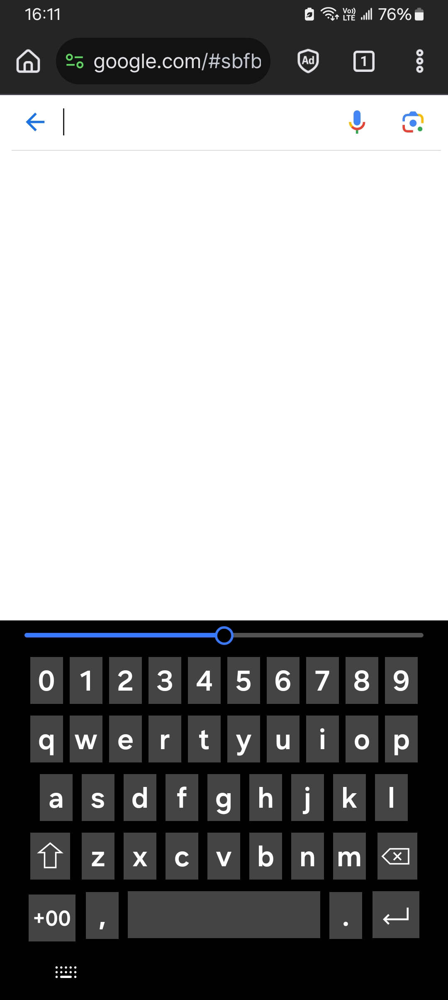
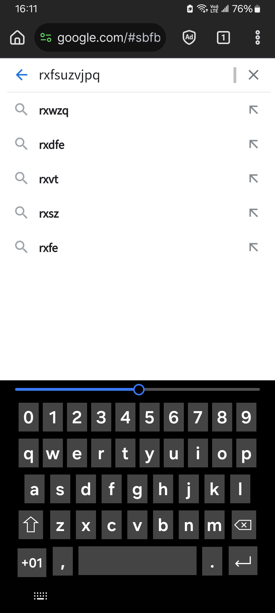

# Caesar Cipher Keyboard

Caesar Cipher Keyboard is an input method based on Caesar cipher.
You may think of it as a kind of emulated simple cipher machine.
That is to say, when you press the '`a`' key, the actual input might not be `a`, but can be `b` or `c`.

It is designed to be used when you want to enter a password but don't want others to know what you're typing.

### Screenshots

### Details

* The keyboard consist of a slider, which is called "cipher disk," and digit keys, alphabet keys and the key for resetting the cipher disk (the key that displays a plus/minus sign and two digits; it displays the current *cipher disk offset*), and other keys like dot, comma and space.

* The total offset between (the symbol of) the pressed key and the actual input depends mainly on two factors: the current cipher disk offset (i.e., the value set with the slider and displayed as a plus/minus sign followed by two digits) and a user-defined offset, which is never displayed on the keyboard and can only be set within this app. The two values are (as if) summed together, and a true modular algorithm is applied to ensure that the final result will be in the range. (Explained in the following.)

* This input method is based on the original 7-bit ASCII (despite that it underlyingly uses UTF-16), and so it can be used to type all the printable original ASCII characters including the space (because you may use it in passwords). If the result shifts beyond `z`, it will go forward to `{`, `|`, `}`, `~` and then back around to space ('` `', 0x20, U+0020).

* The algorithm that maps a key to the actual input is as follows: `32 + ((A - 32) mod 95 + B mod 95 + C mod 95) mod 95`, where the result of `mod` is wrapped to zero or a positive number. This ensures that the result is in the range of printable ASCII characters.

* Unlike the alphabet or digit keys, the comma, dot (period) and space keys are considered "unrotated," meaning they will not be mapped to another symbols, and will always enter a comma, dot or space. Similarly, the backspace and enter keys will always send key codes, and are unaffected by the offsets.

* The upper key, or capitalization key, works like a dead key; its normal function is to make the next alphabet capitalized. And it does so by decreasing the current total offset by 32 (that is, to add an offset of `-32`; this offset can be changed in settings.) when an alphabet key is pressed, so it might not always produce an uppercase letter when the original total offset is not zero. When it is pressed, the appearance of keyboard will not change; the alphabet symbols on the keys will not be capitalized (this input method has no such functionality), because you will not want others know that you use a capital letter in your password. You will not know if the capitalization key in this keyboard is pressed unless you are the one who press it or the one who see the user pressing it.

* The cipher disk resetting key, which displays the disk offset, will only display the current cipher disk offset, not the total offset (disk offset + user-defined offset + capitalization offset). When you tap on it, it will only reset the current cipher disk offset to zero.

* This input method is designed such that the information shown on the keyboard is not enough to infer which key will type which character, but if you're the user, you are able to infer it by doing simple calculations.

### Note

* To type all-uppercase, set the total offset to `-32` and use the alphabet keys. Don't use the capitalization key for that; it doesn't have such functionality.

* This keyboard has no so-called "second page" nor "symbol pad." Special characters are input by setting the offsets correct and using the regular keys.

* By math, when the cipher disk offset is set to any of `0`, `95` or `-95`, the result will always be the same as the other two.

